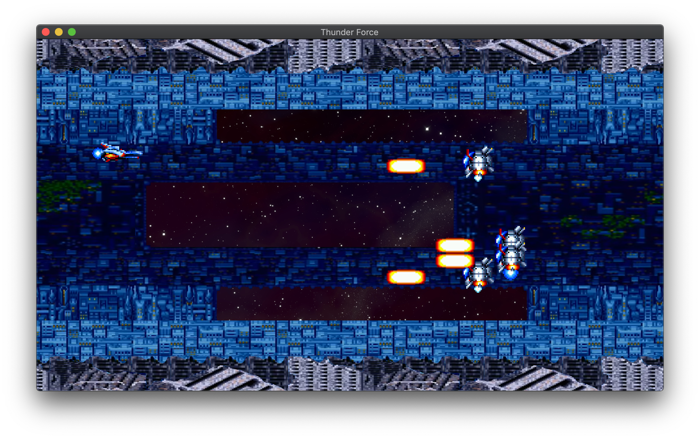
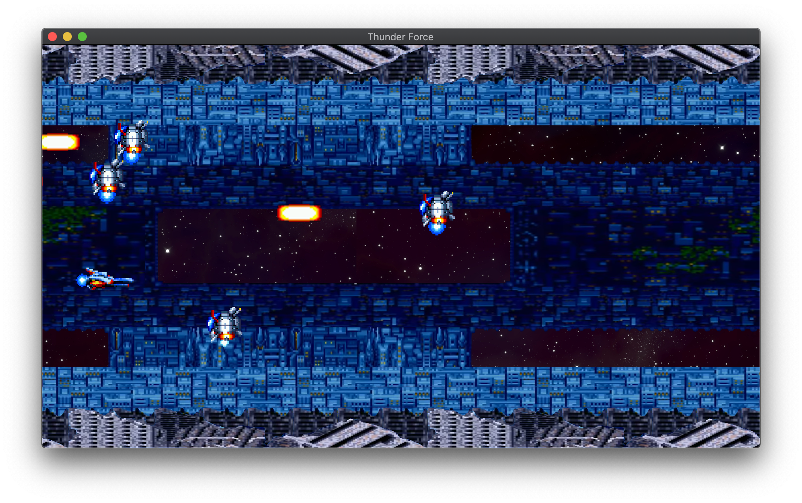

# CPP_rtype_2019
3rd year project in C++ that implements another version of the famous R-type serie video game. It is a horizontal-scrolling shooter game in which the goal is to destroy as much as possible aliens ships. The further the star ship goes the fastest becomes the environment, which means parallax's backgrounds accelerate more and more.
The software consist of a multi-threaded home made server UDP and a graphical SFML UDP client. It can be played in LAN between computers (multi-player) and up to 4 players in a single game. when a game is full the server creates another one with the help of threads.
Also a basic game engine is included in the software and controlls all the game logics + physics. On the other hand inputs are handled on the client side which also displays the different entities didacted by the game engine.
The core included inside the server is responsible for the process (serialization) + flows of datas between game engine/clients and take care also of the new requests from clients.
The game is cross-platform for linux, macOS and windows by using Cmake as a building tool. The dependencies are handled by Conan.

PREREQUISITES :

SFML and Conan must be installed.

KEY MAPPING :

"arrow keys" to move and "space" to shoot.

USAGE :

1) rm -rf build ; mkdir build && cd build && conan install .. --build=missing && cmake .. -G "Unix Makefiles" && 
cmake --build .

Locally (127.0.0.1 for client when entering inetAddress) :

- From one terminal :

a) ./build/bin/server

- From another terminal :

b) ./build/bin/client
  
  > Enter an inetAddr: 127.0.0.1.
  
LAN :

- From one computer :

a) ./build/bin/server

- From another computer :

b) ./build/bin/client

  > Enter an inetAddr: [addr of the server].
  
  
NOTE:

The inet IP address of a computer can be found after doing "ifconfig -a" inside a terminal.

